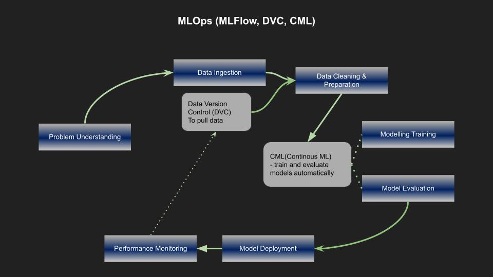

# ab_testing

This repository is used for week 2 challenge. The instructions for this project can be found in the challenge document.
The objective of this project is to determine if the creative ad designed by SmartAd had a better impact on brand awareness
than a dummy ad.

After EDA(notebooks/data_exploration), We have used two approaches to test in this repository.

- Classical AB test (notebooks/classical_ab_testing),
- Sequential AB test (notebooks/sequential_ab_test)

## ML Pipeline 
The following chart shows an ML pipeline architecture that will be followed in this project.

CML (Continuous Machine Learning) will help train and evaluate models — and then generate a visual report with
results and metrics — automatically on every pull request.

On the other hand, we might have a large dataset and will not upload them to our git repo,
hence DVC (Data version Control) will  be used. It is designed to handle large files, data sets, machine learning models, and metrics as well as code.

